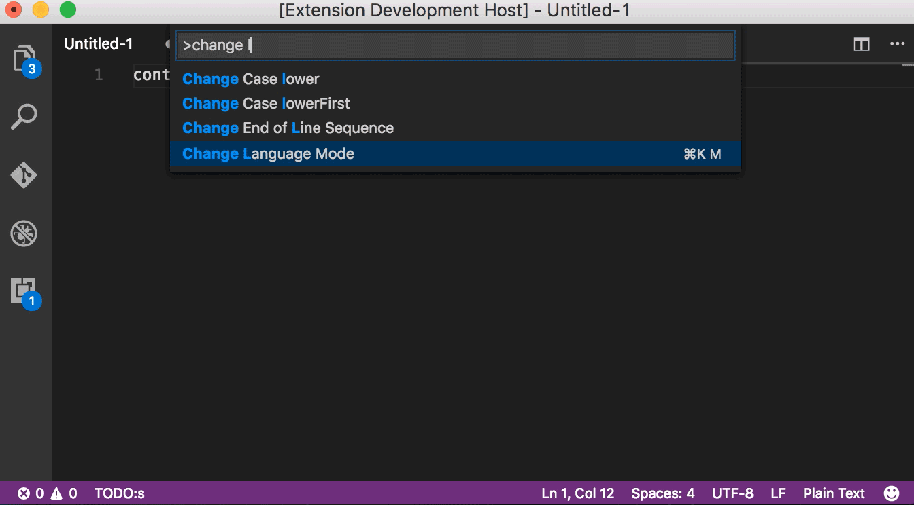
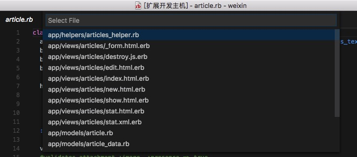

# rails  

* Ruby on Rails "Asset Helpers" and "Tag Helpers" snippets.
* .erb syntax highlights.
* Navigation between related files through command.
* Go to Definition.

## Features

Navigation between related files.

## Default keybinding

* Alt + . (Alt + dot)
* Opt + . (Opt + dot Mac)

## Known Issues  

This extension is not fully implemented form_helpers of rails edge version ,exclude "select" families,"fields_for".
[Form Helpers](http://edgeguides.rubyonrails.org/form_helpers.html)

## Todo List

List sort by priority.

- [ ] avoid ruby's std lib go to definition.
- [ ] avoid rails's go to definition.
- [ ] controller's filters、actions and helpers go to definition.
- [ ] model's go to definition.
- [ ] file path suggestion in controller and views etc.
- [ ] controller's go to definition seaching with parents.
- [ ] seaching definition in gems.

## Contribution

This extension made by mine free time,contributions are welcome!

## Release Notes  

### 0.5.3

Enhance controller‘s concerns、views、lib and models definition

### 0.5.0  

Implementing controller‘s concerns、views、lib and models definition

### 0.4.0  

Improving file search and complete spec and test file type.  

### 0.3.0

Rails navigation taken from [https://github.com/hjleochen/vscode-rails-nav](https://github.com/hjleochen/vscode-rails-nav)

### 0.2.0

Taken grammers from [https://github.com/craigmaslowski/vscode-erb](https://github.com/craigmaslowski/vscode-erb)

### 0.1.0

Initial release of vscode-rails

-----------------------------------------------------------------------------------------------------------

**Enjoy!**